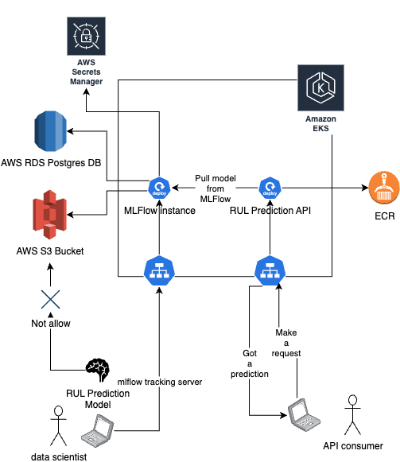
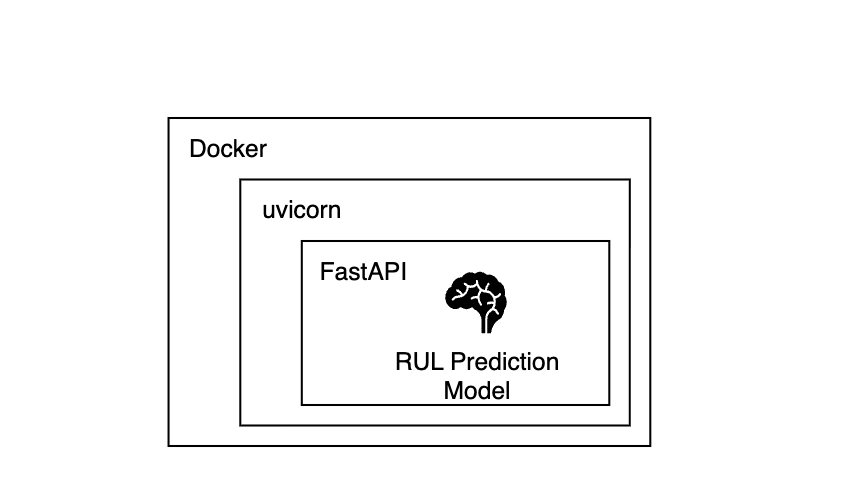

# Technical Design Document Template for Remaining Useful Life Prediction (RUL Prediction) Project

## Introduction

* **Purpose:** This document outlines the technical design for an end-to-end machine learning solution that predicts imminent machine failures.
* **Scope:** The design covers all aspects from model development, api development and packaging to deployment within the defined dataset and infrastructure on kubernetes and AWS. It does not include data ingestion, model evaluation or advanced modeling techniques beyond what is necessary for a defensible solution, nor does it address unrelated business processes or external systems not specified in this project.
* **Audience:** It serves as a guide for developers and MLOps engineers involved in building and maintaining the solution.

## Overview

* **Project Name:** Remaining Useful Life Prediction
* **Problem Statement:** Unexpected machine failures cause costly downtime. There is currently no automated way to predict these failures.
* **Goals & Objectives:** This project aims to deliver a reliable and maintainable end-to-end ML solution that predicts whether a machine will fail in the near future, using the provided dataset. This solution aims to predict the **Remaining Useful Life** (RUL) of industrial machines using sensor, maintenance, error, and failure data.
The strategy is to merge multiple data sources for each machine, identify the time of the next failure (or assume the last record if no failure exists),
and compute the remaining time until that failure for every record in this way, the model learns to estimate how many hours the machine has left before failing, from any point in the data history.
* **High-Level Architecture:** Provide a high-level overview of the system architecture, potentially including a simple diagram.

[](./images/High-Level-Architecture.png)

## System Components

|  **Service**   | **Description** |
|----------------|-----------------|
| MLFlow Web UI | Provides a user interface for managing and visualizing machine learning experiments, models, and deployments. |
| MLFlow Tracking Server | Manages the machine learning lifecycle, including logging, organizing, and visualizing machine learning (ML) experiments and runs, enabling collaboration and centralized access to experiment data within a team. |
| Model Inference Service API | Exposes endpoints for real-time model predictions processing. |

## Cloud Infrastructure Components

|  **Service**   | **Description** |
|----------------|-----------------|
| EKS Cluster | Hosts the entire application, including MLFlow instance, tracking server and model inference service API. |
| S3 Bucket | Stores the trained machine learning model. |
| RDS Instance | Serves as the primary database for the MLFlow instance. |
| AWS Secrets Manager | Manages sensitive information such as: <br> - Database credentials <br> - MLFlow Web UI authentication credentials <br> - AWS credentials. |
| ECR Repository | Stores Docker images for the application components. |

## APIs

### health check endpoint

* **Endpoint:** `/health`
* **Method:** `GET`
* **Description:** Checks the health status of the service.
* **Response:**
    * `200 OK` - Service is healthy.
    * `500 Internal Server Error` - Service is unhealthy.

### Prediction endpoint

* **Endpoint:** `/predict`
* **Method:** `POST`
* **Description:** Accepts input data and returns the predicted remaining useful life (RUL)

| **property**          | **Description**                                                                                            |
|-----------------------|------------------------------------------------------------------------------------------------------------|
| inputs                            | API input array                                                                                |
| inputs[].item                      | Each item in the inputs array represents a single record with the following features:         |
| inputs[].item[]machineID           | Unique identifier for each machine.                                                           |
| inputs[].item[]volt                | Voltage sensor reading at the given timestamp.                                                |
| inputs[].item[]rotate              | Rotational speed sensor reading.                                                              |
| inputs[].item[]pressure            | Pressure sensor reading.                                                                      |
| inputs[].item[]vibration           | Vibration sensor reading.                                                                     |
| inputs[].item[]age                 | Age of the machine in operational cycles or hours.                                            |
| inputs[].item[]error_count         | Number of errors recorded for the machine at the timestamp.                                   |
| inputs[].item[]failure             | Indicator if a failure occurred at the timestamp (1 = failure, 0 = no failure).               |
| inputs[].item[]model_model2        | Binary flag indicating if the machine is of model 2.                                          |
| inputs[].item[]model_model3        | Binary flag indicating if the machine is of model 3.                                          |
| inputs[].item[]model_model4        | Binary flag indicating if the machine is of model 4.                                          |
| inputs[].item[]comp_comp2          | Binary flag indicating if component 2 is present or active.                                   |
| inputs[].item[]comp_comp3          | Binary flag indicating if component 3 is present or active.                                   |
| inputs[].item[]comp_comp4          | Binary flag indicating if component 4 is present or active.                                   |
| inputs[].item[]maint_comp_comp2    | Binary flag indicating if maintenance was performed on component 2 at the timestamp.          |
| inputs[].item[]maint_comp_comp3    | Binary flag indicating if maintenance was performed on component 3 at the timestamp.          |
| inputs[].item[]maint_comp_comp4    | Binary flag indicating if maintenance was performed on component 4 at the timestamp.          |
| inputs[].item[]year                | Year of the record's timestamp.                                                               |
| inputs[].item[]day                 | Day of the month for the record's timestamp.                                                  |
| inputs[].item[]month               | Month of the record's timestamp.                                                              |
| inputs[].item[]hour                | Hour of the day for the record's timestamp.                                                   |
| inputs[].item[]fail_year           | Year of the next failure event for the machine.                                               |
| inputs[].item[]fail_day            | Day of the next failure event for the machine.                                                |
| inputs[].item[]fail_month          | Month of the next failure event for the machine.                                              |
| inputs[].item[]fail_hour           | Hour of the next failure event for the machine.                                               |

* **Example**

For a single input record:

```json
{
  "inputs": [
    [0.53817403, -0.74907903, 1.88965276, -1.28532475, -0.56549519, -0.91290681, -0.18549108, 0.40067865, -0.45048679, -0.7330724, 1.45115695, -0.59478694, -0.56197962, 1.72999716, -0.59478694, -0.56197962, 1.72999716, -0.02917333, -0.53500489, 0.42841932, 0.94393506, -0.14338868, 0.0, 0.0, 0.0]
  ]
}
```

For multiple input records:

```json
{
  "inputs": [
    [0.53817403, -0.74907903, 1.88965276, -1.28532475, -0.56549519, -0.91290681, -0.18549108, 0.40067865, -0.45048679, -0.7330724, 1.45115695, -0.59478694, -0.56197962, 1.72999716, -0.59478694, -0.56197962, 1.72999716, -0.02917333, -0.53500489, 0.42841932, 0.94393506, -0.14338868, 0.0, 0.0, 0.0],
    [0.29524469, -0.75962859, -0.82899489, 0.44905131, 0.53891145, 0.9717234, -0.18549108, 0.40067865, -0.45048679, 1.36412174, -0.68910534, -0.59478694, -0.56197962, -0.57803563, -0.59478694, -0.56197962, -0.57803563, -0.02917333, 1.73571382, -1.02238724, -1.22316561, -0.14338868, 0.0, 0.0, 0.0],
    [1.16284947, 2.18216005, -1.12740242, -0.33800597, 1.41502164, -0.39891675, -0.18549108, 0.40067865, -0.45048679, 1.36412174, -0.68910534, -0.59478694, -0.56197962, 1.72999716, -0.59478694, -0.56197962, 1.72999716, -0.02917333, 0.7138904, 0.42841932, 0.65498831, -0.14338868, 0.0, 0.0, 0.0]
  ]
}
```

* **Response:**
    * `200 OK` - Returns the predicted RUL.
    * `400 Bad Request` - Invalid input data.
    * `500 Internal Server Error` - Prediction error.

### API architecture diagram

Docker was used to containerize the application components, ensuring consistency across different environments. The Docker images are stored in an Amazon Elastic Container Registry (ECR) repository, facilitating easy deployment and version control.

[](./images/API.png)


## Technical Choices & Justifications

### Kubernetes using EKS in AWS

* **Role:** Orchestrates containerized application components, providing scalability, resilience, and simplified deployment.
* **Design Decision:** 
  * Selected for robust orchestration
  * Automated scaling
  * Self-healing
  * Seamless microservices management
  * AWS Secret management integration to pull sensitive data for application components.
  * Helm charts to simplify deployment and management of application components.

### MLflow

* **Role:** Manages the machine learning lifecycle, including experiment tracking, model management, and deployment.
* **Design Decision:** Chosen to standardize experiment tracking and model management, enabling collaboration and reproducibility.

### AWS Secrets Manager

* **Role:** Securely stores and manages sensitive credentials and configuration secrets for the application.
* **Design Decision:** Adopted to centralize and secure sensitive information, reducing credential leak risks and simplifying secret rotation.

### Terraform

* **Role:** Infrastructure as Code (IaC) tool for provisioning and managing cloud resources.
* **Design Decision:** Chosen to enable consistent and repeatable infrastructure deployments, facilitating version control and collaboration.

### FastAPI

* **Role:** Framework for building the model inference service API.
* **Design Decision:** Selected for its high performance, ease of use, and automatic generation of interactive API documentation.

### Docker

* **Role:** Containerizes application components for consistent deployment across environments.
* **Design Decision:** Chosen for its widespread adoption, ease of use, and ability to ensure environment consistency, Local development to production parity.

